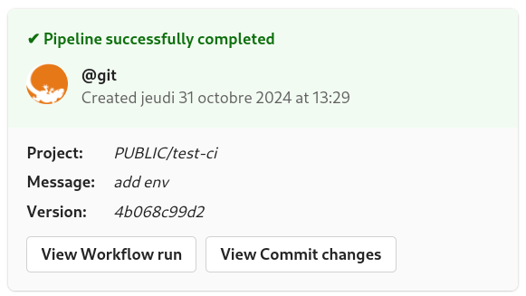
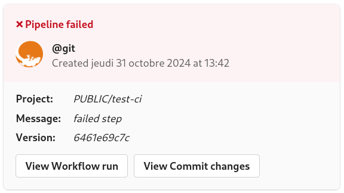

# Woodpecker CI - Teams Notify plugin

[](https://ci.geco-it.net/repos/woodpecker/plugin-teams-notify)
[](https://git.geco-it.net/woodpecker/plugin-teams-notify.git/issues?state=open)
[](https://git.geco-it.net/woodpecker/plugin-teams-notify.git/pulls?state=open)
[](https://git.geco-it.net/woodpecker/plugin-teams-notify.git/releases)
[](./LICENSE)

> **Warning**
> Read-only source code mirror of Geco-iT Open Source projects.

Woodpecker plugin to send teams notifications for build status

For create an Teams Webhook follow [this](https://learn.microsoft.com/en-us/microsoftteams/platform/webhooks-and-connectors/how-to/add-incoming-webhook)

> **Note**
> On Windows, we use _file.exe_ tool for detect type mime from <https://gnuwin32.sourceforge.net/packages/file.htm>

For plugin usage please take a look at [docs.md](./docs.md)

## Build

Build the binary with the following commands:

```bash
# Linux image
$ docker buildx build -t gecoit84/woodpecker-teams-notify-plugin .

# Windows image
C:\> docker build -f Dockerfile.Windows -t gecoit84/woodpecker-teams-notify-plugin .
```

## Supported architectures

The following architectures are supported/tested:

- linux/amd64
- linux/arm64
- windows/amd64

## Result

- Success Build Notification



- Failed Build Notification



## License

Released under GPLv3+

## Author Information

This plugin was created by Cyril DUCHENOY, CEO of [Geco-iT SARL](http://www.geco-it.fr).
