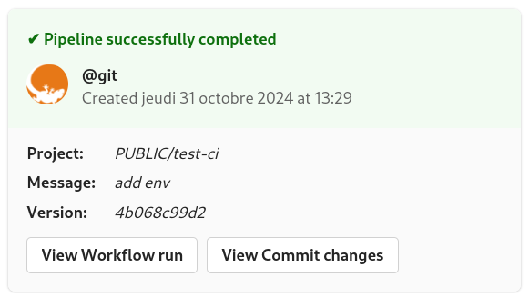

# Teams Notify

Plugin for sending Microsoft Teams notifications with pipeline status.

For create an Teams Webhook follow [this](https://learn.microsoft.com/en-us/microsoftteams/platform/webhooks-and-connectors/how-to/add-incoming-webhook)

## Settings

| Settings Name   | Default | Description                                                   |
| --------------- | ------- | ------------------------------------------------------------- |
| `url`           | _none_  | Teams Webhook URL                                             |
| `private_forge` | _false_ | Set this to true if your forge is not accessible to the world |
| `debug`         | _false_ | Enable Debug mode                                             |

## Pipeline Usage

```yaml
...
steps:
  teams-notify:
    image: gecoit84/woodpecker-teams-notify-plugin
    settings:
      url:
        from_secret: teams_webhook
    when:
      - status: [success, failure]
        event: [push, tag]
...
```

## Result

- Success Build Notifcation



- Failed Build Notifcation


